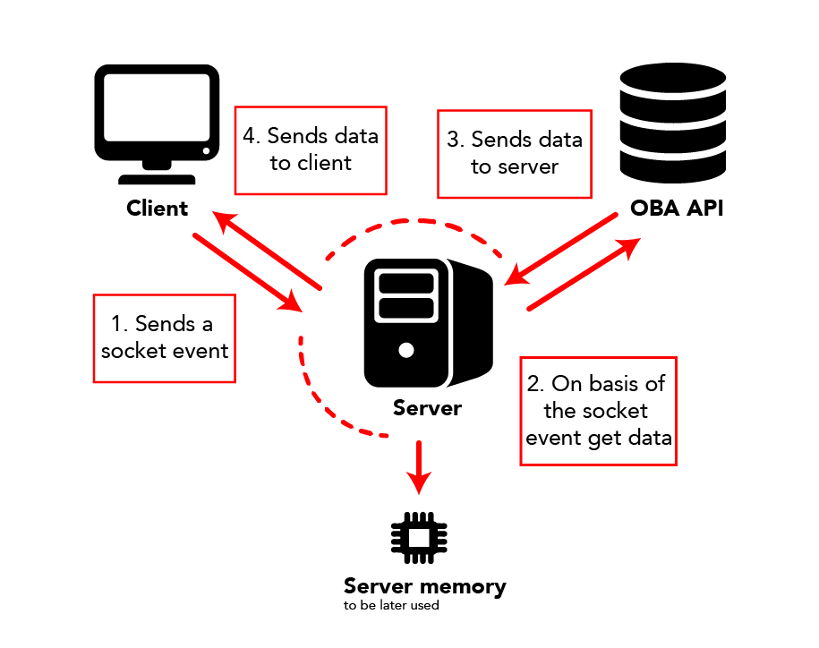

# Boegle - Victor

Five weeks ago we had no idea where we would be on this moment. What have we done by then? What do we learn? At the moment I can tell exactly about what the answers are. In this document you can find everything about the 'Meesterproef' and what I did the past five weeks.

Amsterdam OBA | To search a book


At the bottom of this readme you can find the team readme. It's the same readme as the [boegle repo](https://github.com/Boegle/Boegle). All things you read there we did together. We divided the application in four things. We choose a part that fits the best by each learn goal we set our selfs.

## Table of contents

- [Description](#description)
- [Team](#team)
    - [Getting started](#getting_started)
    - [Progression](#progression)
        - [Week 1](#week-1)
            - [User story](#user-story)
            - [User scenario](#user-scenario)
            - [Concept](#concept)
        - [Week 2](#week-2)
            - [Automate workflow](#automate-workflow)
            - [Coding](#coding)
            - [Presentation](#presentation)
        - [Week 3](#week-3)
            - [Product](#product)
            - [Testing](#testing)
        - [Week 4](#week-4)
            - [Testing](#testing-1)
        - [Week 5](#week-5)
            - [Mobile](#mobile)
            - [Poster](#poster)
            - [Product video](#product-video)

## Description
The OBA Search a Book is an application where an user can search for a book that they vaguely remembered. If anyone doesn't know the writer or title of a book the user can use our application. With not a lot of information. 

This application is created by Chanakarn Niyornram, Victor Zumpolle, Emiel Muis and Desley Aalderink commissioned by Openbare Bibliotheek Amsterdam. 

## Learning goals

1. Working with modules (in JS)

2. Working with data. Where does the data 'life' in the application

---

Added later because I earlier didn't think to work in a team. In the end I choose to work in a team because I think we together could make a better problem. This because everyone had kind of the same idea of the application.


3. Working in a team. How can I make sure I can trust other people to do the job.

4. Getting a great GIT workflow. Using git in the command line etc.

## What?

Below you can find of all things I did. To see a list of code I added to the website you can [click here](https://github.com/Boegle/Boegle/pulls?utf8=%E2%9C%93&q=is%3Aclosed+is%3Apr+author%3Avelomovies+). 

Next to the link I made a list of what I did and how it covers my learning goals.

* Helped with setting up the npm scripts
* Working with socket IO
* Getting data from OBA
* Showing data from OBA
* Did a lot of code reviews
* Used ejs templating
* Filter all data
* Had discussions about code
* Made a point system
* Made a poster
* Filmed a video

## Classes

In the minor we did six different classes. We had to make sure that we used a few subjects in our application. You can see that all six are listed. Every subject has a little explanation. Most of the things we did together in a team. This is why you see 'we' so often. 

Most of the things I did was with the data we could get from the OBA and the data to be send to the user. If it was needed I did some frontend a few times. This immediately did learn me how to let go of something and trust that it will be beautifull.

With most of the subjects we could have done more, but time was not on our side. We wanted to make sure there was a fully working version and after that we would look in to other things. I said, we could, and thats true. All the things we could do where on the Could of MoSCoW.

### Web app from scratch

We had a convention in the team to use object oriented javascripting. So everywhere there is javascript we used objects. Next to that I made modules server and client side. I learned about the big difference in 

serverside:

```javascript
const moduleTwo = require('./moduleTwo')

//Run some code using moduleTwo

module.exports = moduleOne
```

clientside:

```javascript
import{mainBook} from './modules/module.js'

// Use module in main.js
mainBook.init()

/////////////////////////

// Some code... in module...
const mainBook = {
    init: function() {
        // Some code
    }
}

export mainBook
```

### CSS to the rescue

I did a few little things with CSS. We choose to only use CSS and not go with 'the usual' SASS. This was because we thought for the scale of this application it would have been undue. Vanilla CSS will last longer in time so if we are able to write good CSS it's a win for us.

### Browser technologies

For browser technologies I did minor things actually to the website. We checked the compatibility of a few devices. That was a succes. Next to that we checked almost every feature in the [caniuse](https://caniuse.com/). The features that could not be used (if they where js) I tried to get working serverside.

We did think about what to do with no-js. We thought about that one and came to a good solution. Because of time we couldn't inplement this fully, but it would have worked as follows:

* The book would have been four pages among each other.
* The results would only return on the result page.
* You submit a form when going to a different page.
* See all results among eachother.
* Not getting live feedback of socket.
* Popups will not popup but you will scroll to the right section.

### Performance Matters

Using severside rendering. There

Send data via socket.io. It will automatically send data when the user has an input.

```javascript
const api = require('./api')

const socketIO = {
  init: function(io) {
    io.on('connection', (socket) => {
      socket.on('searchValues', (data) => api.getUrl(io, socket, data))
    })
  }
}

module.exports = socketIO
```

### Webdesign

We made sure we used a few principles. We all did webdesign in our application. 

Next to webdesign I also did a design thing. I made the poster for the presentation.

<details>
<summary>Click to see: some posters</summary>
<p>poster</p>


</details>

### Realtime web

Used api that should be updated every day. I used the OBA api. The data model for the application was as follows:


> This is the way data is send through the application

## Proudest Code

The code I liked the most was about making sure the user got the right book. It is a complicated filter system. The problem I had was that the data I got only showed 20 results. For every other 20 it would the loading be slower. In the end it resulted in a longer loading time but much more accurate results. 

Data I could filter in the call was:
* Title
* Author
* Published year
* Genre
* Target audience
* Language

A few data points I had to search per result and could only be done when you click on the result button. That data consists of:
* Publisher
* Cover color
* 2nd author/illustrator
* Summary
* Kind of illustrations

The last list was the most difficult to filter. I came up with an idea for ordering the results instead of filtering on that list. I made code that would give points everytime users input and the book would match. It will check each word of the summary and compare it with the users input.

```javascript
if(userData.summary[0] !== '') {
          userData.summary.forEach((word) => {
            if(dataElement.summary.indexOf(word) > -1) {
              console.log('Add 1 point for summary')
              dataElement.point++
            }   
          })
        }

        if(userData.illustrator[0] !== '') {
          userData.illustrator.forEach((word) => {
            if(dataElement.illustrator.indexOf(word) > -1) {
              console.log('Add 10 points for illustrator')
              dataElement.point = dataElement.point + 10
            }
          })
        }

        if(userData.publisher[0] !== '') {
          userData.publisher.forEach((word) => {
            dataElement.publisher.forEach((element) => {
              if(element.indexOf(word) > -1) {
                console.log('Add 10 points for publisher')
                dataElement.point = dataElement.point + 10
              }
            }) 
          })
        }

        if(userData.pages !== '1') {
          if(Number(userData.pages) + 100 > Number(dataElement.pages) && Number(userData.pages) - 100 < Number(dataElement.pages)) {
            console.log('Add 5 points for pages')
            dataElement.point = dataElement.point + 5
          }
        }

        if(userData.illustrations !== '') {
          if(userData.illustrations === 'color' && dataElement.illustrations.indexOf('gekleurde') > -1) {
            console.log('Add 10 points for color')
            dataElement.point = dataElement.point + 10
          } else if (userData.illustrations === 'black' && data.illustrations.indexOf('zwart-wit') > -1) {
            console.log('Add 10 points for black and white')
            dataElement.point = dataElement.point + 10
          }

          if((userData.illustrations === 'color' || userData.illustrations === 'black') && dataElement.illustrations.indexOf('ill') > -1) {
            console.log('Add 5 points for illustrations')
            dataElement.point = dataElement.point + 5
          }
```

The code below would put the book with the most points in front. That way it is more likely that the user gets his result even though there could be 100 results.

```javascript
const processData = {
    compare: function(a, b) {
        const pointA = a.point
        const pointB = b.point

        let comparison = 0
        if(pointA > pointB) {
        comparison = 1
        } else if(pointA < pointB) {
        comparison = -1
        }
        return comparison * -1
    }
}
```

## Git flow

In our git flow we delete branches that aren't used anymore. That makes it much more readable when you are searching something. We choose to have a few commit messages. In all caps you had to choose what you wanted to do. Like adding a slider would be: `ADD - Working slider`.

We protected the develop branch and made sure there had do be at least one person checking your code. That way we should have much more consistent code through the whole application. It was strictly forbidden to set something on the main branch. For every feature of fix there had to be a new branch. The branch name was either `fix or feature` with a `/`. So adding a filter would have been: `feature/filter`.

## Video

At the beginning of the 'Meesterproef' we talked about filming a nice video. I thought personally that there would be not enough time. In the end we just went with it and went to a cool studio in Amsterdam. 

Emiel made a storyboard and with 2 days to go we had to prepare for everything. I wanted to do the camera work so I prepared all my stuff. In the end we filmed for 5 hours and in the end had a nice video. In my process book I put a few images. Next to that you can find the video [here](https://drive.google.com/open?id=1dJvaKSNhK3F9K717XYYtxqhfJ6Q5CnCg).

---

---

## Team

From here is the team readme. This one has a overview of all weeks and what we all did together.

### Getting started

Install all dependencies
```
npm install
```

Create .env file in directory and add your preferences
```
HOST = 3000
PUBLIC_KEY = public key name
SECTRET_KEY = secret key name
```

Start application
```
npm start
```

Standard port is 3000
```
localhost:3000
```

### Progression

*The progression section gives a weekly insight to what the team is working on, what for problems we've encountered and how we've dealth with the problems during our project.*

#### Week 1

The focus of the first week lays on understanding and debriefing the client problem. From there we're creating an user story and an user scenario that gives us an idea what the visitors of the OBA wants and how the perfect scenario would be. And last but not least creating a concept for solving this solution.

##### User story

The high school student comes in the OBA and is looking for a book. With a description without title and writer, the librarian can do nothing. The student can use the installation next to the desk to find his / her book. The books are filtered by - among other things -  the subject, thickness of the book and the color of the cover. The student finds the right book, can see where it is, whether it is available and then borrow the book.

##### User scenario

The high school student is looking for a book, of which he or she no longer knows the title and the writer. Through a web application, the student can find the book in the OBA.

##### Concept

To comes up with a concept, we first generate ideas that are enable to solve this problem. 

<details>
<summary>Click: to see mindmap of the ideas</summary>

</details>

After generating ideas, every member created their own concept of a web application that will solve the problem. The concept is than shown to the team and at the end of the day the team will pick an aspect of a concept that is suited for solving the problem really wel.

<details>
<summary>Click: to see concepts</summary>
<p>Wall of generated concept</p>


<p>Zoomed in on a concept</p>

</details>

#### Week 2

The focus of the second week is setting up a development workflow and understand the API that is given from OBA.

##### Automate workflow

To streamline our development enviroment we're creating a taskrunner that will automate some of our work. Those work are:

- compilling sass
- combine javascript module
- watch files
- start server
- linter

There are a lot of taskrunner that we can use. To choose a correct taskrunner Desley has done research to some of the most used ones. You can find the document [here](). The list is created with a pro and con from each taskrunner and from that we choose one with the most pro. 

The taskrunner that we've settled with is Gulp. Gulp is written in Javascript which mean it's easy for us to start developing the automated task. It's also very easy to add a new automated task to the system.

When presented this to our mentor, he was not very pleased to the conclussion we've come up with. He advised us to use NPM Script, because it use less command and it takes less time to set-up and start developing.

After the presentation we have had a discussion about the feedback that is given by our mentor. We discussed if we're going to rewrite our Gulp taks in NPM Script - that mean a whole day work is gone - or are we're going to keep the Gulp taks.

After a long discussion we're going to rewrite the Gulp task in NPM Script because:

- We're already starting the server with __npm start__ so when we're adding some other automated tasks, than it's very logical to do this within the same command line.

- We have never work with NPM Script before, so NPM Script will be a new learning oppertunity for us. 

- When NPM install, all dependencies of the automated script will be installed, so when someone else clone our repository, than they will also have and understand the task that will be runned.

##### Git flow 

To be able to develop in a team, we're using git as our Version Control System and using Github as our platform for uploading our code. To avoid conflict we're are going to create branche whenever any feature is added. 

When presented this to Danny (our advisor), he found it a good idea, but it's not good enough to create consisteny and avoiding conflicts. With the help of Danny he presented idea's that we can use to create a better git flow. Those idea are:

- A convention for commit messages
- Pull request need to be checked before any merge
- Create a develop branch and merge this to the master whenever a new version is ready.
- Create a Github project that keep tracks of tasks and progress
- ~~Create a template for Issues~~~

With the help of Danny, we've implemented every ideas except the Template part, because we think it's unnecessary because the project is private for now.

##### Coding

To understand and create a better concept for the problem, we need to know which data the API is giving us. Two members worked on this.
The problem was that they a different module for this. One member worked with  Request module and the other with the Node-fetch module. This create conflict. 

After a discussion we choose to use Node-fetch. We choose this because, it use the same fetch syntax as the front-end. This means that other member of the team are able to understand the code better. Also it creates concistency in the code, between the front- and backend.

##### Presentation

We pitch our idea and concept to Mark (product owner) to get feedback and to know what he's opions is about the concept.

<details>
<summary>Click to see: photo of the presentation</summary>
<p>Presentation</p>

</details>

#### Week 3

The focus of week 3 is to create a proof of concept and test this out with real users.

##### Product

When we first starting to create this applicatoin, we intentionally didn't focus  on the appearence, because we want this application firstly to work. 

This is an image of the early version of our application.


##### Testing
To make this application really great and to see if our product really work, we need to test this with real users. Mark created an appoinment with one of the Highschool in the area for us to test. However because of miscomunication we aren't able to test the application further. 

But we still need to know if our app works, so we test our app with our colleague and our mentor.

<details>
<summary>Click to see: photo of the test</summary>
<p>Test with colleague</p>


<p>Test with mentor</p>

</details>

__Feedback (in dutch)__
- Doelgroep = Jeugd of none (wegens fout API)
- Slider
     - Krijgt mousedown (voor constante feedback)
     - Min = 50 of minder
     - Max = 500 of meer
     - Begint met animatie
     - Moet meer opvallen
- Titel, auteur en taal overruled een hoop
- Form vragen moeten "vragender"
- Placeholder moet òf meer placeholder-achtig òf verdwijnen na :focus
- Knoppen onderin moeten een animatie krijgen
- Kleur van de tekst moet veranderen als de kleur van de kaft verandert
- Resultatenknop
     - Font-weight moet hoger
     - background-color moet worden verandert
     - moet meer opvallen
     - animeren na het kunnen tonen van resultaten
- Cutsom Select moet scrollen na het openen om de mogelijk tot scrollen te verduidelijken
- State 4 naar 2 na gebruik slider gaat kapot door het verkeerd verwijderen van class "none"
- Er moet een terugknop komen op de resultaten- en detailpagina

#### Week 4
The focus of week 4 is to work further and improve the application with the feedback that is given. And also to test it with real users.

##### Testing
After improving our applicaton we went to a highschool in our area. We test our application with five users and every test is done individually. 

[Link to our testplan (in dutch)](readme_assets/testplan.pdf)

<details>
<summary>Click to see: feedback of the test (in dutch)</summary>
<p>Feedback</p>


</details>

#### Week 5
The focus of week 5 is to improve our application and to make the application useable for mobile so that even a user at home is able to use the application.
We also created a poster and a product video for our end presentation.

##### Mobile
We made the application useable for mobile and this is how it looks.


##### Poster
We've also made poster to put at our stand for the end presentation.

<details>
<summary>Click to see: some posters</summary>
<p>poster</p>


</details>
